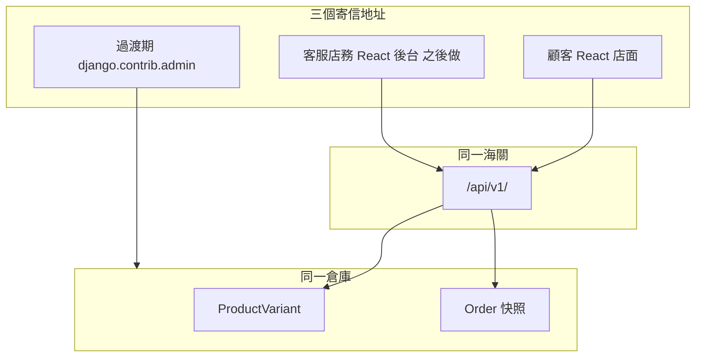

# shop 重整開工清單 v2.7

**開工令：P1–P3 閘門綠（9/3）。** 這份清單是開工順序與驗收標準，不是「先把表推倒」。**現行 blocking → P4**（Cart API：session 車、`variant_id`、禁止 GET 改狀態）。

三件 v2 變更：

1. **期限改為軟期限，以進度為期限。** 沒有硬日曆底線；**期限＝未綠的閘門**。每階段有段數預算（1 段 ≈ 一次 2–3 小時的坐下時間），超支的處置是**砍範圍**，不是延期。
2. **Docker 歸 shop 自己。** 它是 **P8**：`web` ＋ `db`（PostgreSQL）的 `docker compose`，跟任何其他專案無關。
3. **只引用 shop 的文件與 shop repo 的真實路徑。** 舊專案的筆記／清單／時程一律不作為依據。

## 驗收兩把尺

| 尺 | 定義 |
| --- | --- |
| **L0** | 沒碰過 |
| **L1** | 講得出機制（不准勾） |
| **L2** | 真碼落地，說得出檔名＋函式名（勾成「已寫、未實測」） |
| **L3** | 端對端實測，貼得出 JSON／畫面／狀態碼（才算完成） |
| **試錯覆蓋率** | 該階段錯誤菜單裡**真踩過**幾項。`L3 + 0` 標成 **L3（脆）**，不算通關 |

**通關條件＝閘門綠 且 試錯覆蓋率 ≥ 2。**

## repo 現況（9/3 已對帳）

| 項目 | 實際情況 |
| --- | --- |
| Django 套件目錄 | `config/`（`ROOT_URLCONF = 'config.urls'`） |
| 版本／資料庫 | Django 5.2 · **PostgreSQL**（`psycopg2-binary`，`.env` 提供 `DB_*`） |
| 已裝 | `widget_tweaks`、`whitenoise`、`gunicorn`、`pillow`、`loguru`、`python-dotenv`、**`djangorestframework==3.18.0`**、**`django-cors-headers==4.9.0`** |
| **未補** | —（P1.0 已補 DRF／CORS；P8 仍靠 `requirements.txt` 這兩行） |
| 路由 | `config/urls.py` 掛了 `pages`、`products/`、`admin/`、`accounts/`、`carts/`、`orders/`、**`api/v1/` → `config.api_urls`**（`categories/`、`products/` 列表／詳情、`csrf/`、`auth/login/`、`auth/logout/`、`me/`） |
| P1 落地檔 | `products/serializers.py`（含 `ProductDetailSerializer`）；`products/api_views.py`（`ProductDetailView`，`lookup_field='slug'`）；`config/api_urls.py`；`products/views.py` `SIZES_LIST` 已改 `2XL`／`3XL` |
| P2 落地檔 | `frontend/`（Vite＋React）；`frontend/.env` `VITE_API_URL`；`src/api/client.js`（`apiFetch` 查 `response.ok`）；`ProductListPage`／`ProductDetailPage`（`variant_id`）；Router `/` 與 `/products/:slug` |
| P3 落地檔 | `accounts/api_views.py`（`csrf_view`、`api_login`、`api_logout`、`me_view`）；`config/api_urls.py` 四條 auth 路由；`config/settings.py` 已有 `SessionAuthentication`／`CORS_ALLOW_CREDENTIALS` |
| Git | 分支 `main`（與 `origin/main` 同步至 P1 merge 後）；P3 本 commit 含 `accounts/api_views.py`＋`api_urls` auth 路由。`frontend/` 仍可能未 commit |
| 測試 | 六個 `tests.py` 全部是空殼 |
| 前端 | **已有** `frontend/`（P2）；P3 後端閘門 Postman 綠；`:5173` 尚未接 `credentials: 'include'` 登入流程 |

## 三個表面共用同一倉庫（不要為後台另起 Product 表）



## 角色（P7 才落地，現在只定名）

- **客服**：查單、改出貨／備註、查會員；**不能**改 SKU 價、不能硬改已付款金額、不能刪訂單明細快照
- **店務**：上架、庫存、分類、圖；**不能**假裝改歷史訂單快照
- **過渡期**：兩者都用 Django Admin（`products/admin.py` 已有 Product inline；`orders/admin.py` 已有 `order_no`／email／phone 搜尋）

---

## P0 決策鎖定（不重開）

- 可賣單位是 `ProductVariant`，不是 `Product`
- 訂單讀快照（`orders/models.py` 的 `OrderItem.product_name` 等），不現場 join 活商品名
- `auth.User` ＋ `users/models.py` 的 `UserProfile`，不造第三套登入
- 認證：Session ＋ CSRF cookie，不先 JWT
- API 前綴：`/api/v1/`
- 過渡期 template 店面與 Admin 並存，不拆

> v2 已刪除舊版的「本階段不寫商店程式碼」與結尾的「仍不改商店程式碼」—— 兩句與開工令矛盾。

---

## 開工順序與段數預算

| 階段 | 預算 | 前置 | 可否提前 |
| --- | --- | --- | --- |
| P1.0 環境與掛載 | 0.5 | — | — |
| P1.1 categories | 0.5 | P1.0 | — |
| P1.2 products list | 1 | P1.0 | — |
| P1.3 products detail | 0.5 | P1.2 | — |
| P2 React 店面 | 2 | P1.2／P1.3 | — |
| P3 Auth | 1 | P1.0 | — |
| P4 Cart | 1.5 | P3 | — |
| P5 Checkout | 1.5 | P4 | — |
| P5.5 測試護欄 | 1 | P5 | 可在 P4 後先寫目錄測試 |
| P8 Docker（shop） | 1.5 | P5.5 | **可提前到 P2 之後**（想先凍環境就提前） |
| P6 Schema 還債 | 2–3 | P5.5 | 否 |
| P7 客服／店務後台 | 4+ | P6 | 否 |

到「店面看得出接了 API 且能下單」是 P1–P5 ≈ 8 段。P7 是第二座網站，不要騙自己它是一個階段。

**每個階段的開工單格式**：動哪些檔 → 契約 → 為什麼 → 錯誤菜單（必踩 ≥2）→ L3 閘門 → 試錯覆蓋率。

---

## P1 目錄唯讀 API（第一段真碼）

`products/models.py` 不動。Django 加 DRF ＋ CORS；template 店面並存。

### P1.0 環境與掛載

- **動哪些檔**：`requirements.txt`、`config/settings.py`、`config/urls.py`，新建 `config/api_urls.py`
- **契約**：`GET /api/v1/` → 200／405（不可以是 404）
- **為什麼**：middleware 順序決定 header 誰先定稿；`/api/v1/` 是三個表面共用的海關，前綴先鎖死才不會之後改一百個 fetch
- **錯誤菜單**
  1. `corsheaders.middleware.CorsMiddleware` 排在 `CommonMiddleware` 之後 → 瀏覽器 CORS 失敗、curl／Postman 正常（**症狀不對稱**）。OPTIONS 預檢仍會 200＋ACAO（Cors 自己回，不能當自證）。真自證：關掉 Follow Redirects，`GET /api/v1`（無尾斜線）看 301 有沒有 `Access-Control-Allow-Origin`
  2. `rest_framework` 加進錯的清單（`INSTALLED_APPS` 是 `DJANGO_APPS + APPLICATION_APPS + THIRD_PARTY_APPS` 三段相加）→ browsable API 炸 `TemplateDoesNotExist`，純 JSON 反而活著
  3. `config/urls.py` 忘了 `include` → 404 而不是 405（**沉默誤導**，你會跑去改 serializer）
  4. ~~`pages.urls` catch-all 吃掉 `api/v1/`~~ → **已排除**：`pages/urls.py` 十條全是具名路徑，只有 `handler404 = 'pages.views.custom_404'`，沒有 catch-all。改踩這個：前綴寫成 `api/v1`（少尾斜線）→ `APPEND_SLASH` 只救 GET 的 301，POST 直接 404
  5. `CORS_ALLOW_ALL_ORIGINS = True` ＋ P3 要的 `CORS_ALLOW_CREDENTIALS = True` → 規格互斥，瀏覽器直接拒
  6. 只 `pip install` 沒寫進 `requirements.txt` → 本機正常，P8build 才炸 `ModuleNotFoundError`
- **L3 閘門**：`curl -i http://127.0.0.1:8000/api/v1/` 第一行不是 404 → **8/29 綠**（`200` + `{}`）
- **試錯覆蓋率**：2/6（#3、#1）→ **通關**（≥2；其餘四項未踩，不擋）

### P1.1 `GET /api/v1/categories/`

- **動哪些檔**：`products/serializers.py`、`products/api_views.py`、`config/api_urls.py`
- **契約**：樹狀（`parent`／`children`）；只回 `is_active=True`；頂層為 `parent=None`
- **為什麼**：樹在後端拼好，前端才不用自己組；否決前端自組，因為那是把契約洩漏給 UI
- **錯誤菜單**
  1. `children` 沒過濾 `is_active` → 200，下架子分類外洩（**沉默失敗**）
  2. 遞迴序列化沒深度上限 → 深樹時查詢數爆或 `RecursionError`
  3. 每個節點各自 `.count()`（`product_list` 現在就這樣寫）→ 查詢數隨分類數線性長
  4. 只回 flat list → 200，但前端得自己組樹（契約缺陷）
- **L3 閘門**：JSON 是樹，且 `len(connection.queries)` 與分類數無關 → **8/30 綠**（curl 樹狀 2 根 + shell `200 1`）
- **試錯覆蓋率**：0/4（菜單未踩；實戰 typo／接錯 View 已修）→ **L3（脆）**；閘門已綠，可進 P1.2

### P1.2 `GET /api/v1/products/`

- **動哪些檔**：`products/serializers.py`、`products/api_views.py`、`config/settings.py`（`REST_FRAMEWORK` 分頁）
- **契約**：`{count, next, previous, results}`；只上架；搜尋需 `distinct()`
- **為什麼**：`queryset = Product.active.all()`（這個 manager 同時做 `is_active=True` 與 `prefetch_related('images','variants')`）；白名單 serializer 管出口；分頁決定前端讀 `data.results` 而不是裸陣列
- **錯誤菜單**
  1. 用 `Product.objects.all()` → 200，下架商品外洩＋ prefetch 消失（**沉默失敗**，curl 看不出來）
  2. `fields = '__all__'` → `base_price`、`image` 路徑、`created_at` 等內部欄位一起出去
  3. 搜尋 join `variants` 沒 `distinct()` → 同商品重複列；順便注意 `product_list` 的 `total_products = products.count()` 也被放大
  4. 沒設 `DEFAULT_PAGINATION_CLASS`／`PAGE_SIZE` → 回裸陣列，前端 `data.results` undefined
  5. 在 view 裡再寫一次 `filter(is_active=True)` → 「上架」有兩個定義，以後改一邊就分岐
  6. 封面直接吐 `Product.image` 但檔案不在 `media/` → JSON 欄位有值，前端圖 404（沉默）
- **L3 閘門**：`curl -s '/api/v1/products/' | jq '.count, (.results|length)'` 兩個數字合理，`results` 是陣列 → **8/30 綠**（`7`／`6`；Postman 同形 `{count, next, previous, results}`，本頁 6 筆）
- **試錯覆蓋率**：0/6（菜單未踩）→ **L3（脆）**。學習者下令直接開 P1.3，不補菜單。
- **落地檔**：`ProductListSerializer`；`ProductListView.get_queryset`（`Product.active` ＋ `q`／`category`／`min`／`max` ＋ `distinct()`）；`REST_FRAMEWORK` `PageNumberPagination`／`PAGE_SIZE: 6`；`config/api_urls.py` `products/`
- **手測備註（不算菜單、不入總帳）**：`?category=gg` → 404（`get_object_or_404`）；`?q=blue` → 200 空集合（庫裡顏色是 `32 BEIGE`／`09 BLACK`／`69 NAVY` 等貨號名，沒有 `blue`）；`?q=XL` 會命中尺寸 `3XL`（`icontains`）；現庫每件商品約 1 列 variant，有無 `distinct()` JSON 都一樣。五個 query 參數不要一次全開，且 `category` 是分類 slug（`tshirts`）不是商品 slug。

### P1.3 `GET /api/v1/products/{slug}/`

- **動哪些檔**：`products/serializers.py`、`products/api_views.py`、`config/api_urls.py`；`products/views.py`（`SIZES_LIST` 順手修）
- **契約**：variants（`id`／`sku`／`color`／`size`／`price`／`stock`／`in_stock`）、images；`current_variant`／`current_color_variants`；支援 `?color=`；封面暫用 `Product.image`（雙軌先不拆，P6 才收）
- **為什麼**：前端必須選到 **variant id**，否則 P4 一定壞；`lookup_field = 'slug'` 才對得上 `get_absolute_url` 的 `reverse('products:product', kwargs={'slug': ...})`
- **錯誤菜單**
  1. `lookup_field` 沒改成 `slug` → 打 slug 得 404
  2. 巢狀 serializer 忘了 `many=True` → `AttributeError` 或怪輸出
  3. 在 serializer 裡 filter 掉 `stock=0` → 缺貨尺寸從 JSON 消失（**契約要求仍吐出，`in_stock: false` 給前端 gray out**；硬加購到 P4 才 409）
  4. 直接吐 `price` 而不是 `final_price` → `price` 可為 `null`（`update()` 繞過 `save()` 時不會補值），前端顯示 `null`
  5. ~~`products/views.py::product` 的 `SIZES_LIST` 寫 `XXL`~~ → **8/31 已修**為 `2XL`／`3XL`
- **L3 閘門**：詳情看得到 variants 與 images，且 `price` 不是 `null` → **8/31 綠**
- **試錯覆蓋率**：0/5 → **L3（脆）**
- **手測證據（8/31）**：`curl …/sweat-oversized-pullover-hoodie/` → 200；`variants[0].price`=`"49.90"`、`in_stock`=false（stock=0）；`images` 陣列 1 筆；`current_variant`／`current_color_variants` 齊。假 slug → 404 `No Product matches the given query.`；`/products/1/` → 404（證明 slug lookup）。`?color=` 手測：占位符 URL 會 jq 失敗——须用真 slug（如 `69-navy`）。
- **落地檔**：`ColorBriefSerializer`／`ProductImageSerializer`／`ProductVariantSerializer`（`source='final_price'`、`in_stock`）／`ProductDetailSerializer`（`_get_current_color`）；`ProductDetailView`（`lookup_field='slug'`，`Product.active.prefetch_related`）；`config/api_urls.py` `products/<slug:slug>/`
- **Git**：`feature/p1-catalog-api` @ `99e1b8d` 已 push origin

**P1 權限（寫死，解決舊版自相矛盾）**：公開 GET；寫入一律 **405**；**P1 不建任何 `staff/` 路由**（舊版寫「契約可在 P1 用 405 佔位」，與 P1 只做唯讀矛盾，以本句為準）。

---

## P2 顧客 React 店面（列表＋詳情）

- **動哪些檔**：新建 `frontend/`（Vite ＋ React Router）、`frontend/.env`（`VITE_API_URL`）
- **契約**：只讀 P1 的三個端點；詳情頁選色／尺寸 → 得到一個 `variant_id`
- **為什麼**：`response.ok` 分流才能區分「送達」與「成功」；variant 選不到就不要讓使用者能按加入購物車
- **錯誤菜單**
  1. 只寫 `.catch` 不看 `response.ok` → 500 被當成成功，畫面空白無錯誤（**沉默**）
  2. 環境變數沒 `VITE_` 前綴 → `import.meta.env` 讀到 `undefined`，請求打到自己
  3. `.map()` 沒 `key` 或用 index → 列表更新錯位
  4. 宣告了 `loading` 但 JSX 沒讀 → 死 state，使用者目瞪白畫面
  5. 詳情頁只記住 `color`／`size` 字串而沒比對出 `variant_id` → P4 必壞
- **L3 閘門**：畫面列出真商品；詳情看得到 variants；選完色／尺寸能在 console 印出 `variant_id` → **9/2 綠**（學習者宣告；`:5173` 列表＋詳情）
- **試錯覆蓋率**：1/5（#1 `response.ok`／假 slug 404）→ **L3（脆）**
- **落地檔**：`frontend/src/api/client.js`；`pages/ProductListPage.jsx`；`pages/ProductDetailPage.jsx`（`?color=` ＋ `current_color_variants` 對出 `variant.id`）；`App.jsx` Routes；`main.jsx` `BrowserRouter`
- **手測備註（不算菜單）**：`singnal`／`signal` 拼錯 → 列表顯示「错误：signal is not defined」；`getProduct` vs `getProducts` import 錯 → `ReferenceError`；`:8000/?category=sweaters` 是模板店面，不會印 `variant_id`。P2 不複製 Pixio 樣式。

---

## P3 Auth API

- **動哪些檔**：`accounts/api_views.py`（新）、`config/api_urls.py`、`config/settings.py`
- **契約**：`GET /api/v1/csrf/`、`POST /api/v1/auth/login/`、`POST /api/v1/auth/logout/`、`GET /api/v1/me/`
- **為什麼**：沿用 Django session（P0 鎖定）；React 需 `credentials: 'include'` ＋ `X-CSRFToken`；不要第三套 User
- **錯誤菜單**
  1. fetch 沒 `credentials: 'include'` → login 200 但 `me` 403（**症狀不對稱**：Postman 正常、瀏覽器不正常）
  2. 缺 `X-CSRFToken` → 403 `CSRF Failed`
  3. 登入後沒重拿 CSRF（token rotation）→ 下一個 POST 403
  4. 後端沒開 `CORS_ALLOW_CREDENTIALS` → 瀏覽器丟掉 `Set-Cookie`，你永遠登不上
  5. `SessionAuthentication` 沒列進 `DEFAULT_AUTHENTICATION_CLASSES` → 拿到 401 而不是你預測的 403
- **L3 閘門**：登入後 `me` 200；登出後 401／403 → **9/3 綠**（Postman：csrf 200 → login 200 → me 200 → logout 200 → me 403）
- **試錯覆蓋率**：3/5（#5 註解 `IsAuthenticated` → 500；POST `/me/` 打錯端點；GET logout → 405）→ **通關**（≥2）
- **落地檔**：`accounts/api_views.py`；`config/api_urls.py` `csrf/`、`auth/login/`、`auth/logout/`、`me/`
- **手測備註（不算菜單）**：`Client.post` → `DisallowedHost: testserver`（`ALLOWED_HOSTS` 無 testserver；手測改用 `RequestFactory`）；Postman 登入誤打 `POST /me/` → 403（端點契約）

---

## P4 Cart API（仍包 session，不加表）

現有 `carts/cart.py` 用 `session['carts']`，key 是 `str(variant.id)`。**以下六項已讀真碼確認，不是猜測**：

- `carts_add` 掛在 `add/<int:variant_id>/`，數量讀 `request.GET.get('quantity', ...)` → **GET 真的會改狀態，連數量都吃 query string**
- 加購全程**沒有任何庫存檢查** → 超賣要到 P5 才會被發現
- `add_to_cart` 從 POST 拿的是 **`sku` 字串**（不是 `variant_id`），數量欄位名叫 `demo_vertical2`，缺貨用 `'out-of-stock'` 字串哨兵
- `Cart.clear()` 是 `del self.session['carts']` → **同一 request 呼叫兩次就 `KeyError`**
- `Cart.__iter__` 對已從 DB 刪除的 variant 直接 `continue`（**沉默消失**，使用者看不到任何訊息）
- 取價用**即時** `variant.final_price` → 購物車不提供價格歷史，快照必須由 P5 自己做

- **動哪些檔**：`carts/api_views.py`（新）、`carts/serializers.py`（新）、`config/api_urls.py`
- **契約**：`GET /api/v1/cart/`、`POST /api/v1/cart/items/`（body：`variant_id` ＋ `quantity`）、`PATCH`／`DELETE` 單項；失敗 400；庫存不足 409
- **為什麼**：只有 `POST`／`PATCH`／`DELETE` 有「改變狀態」的語意；GET 在協定上可被重送與快取；禁止只送 `product_id`，不讓後端替使用者猜尺寸
- **P4.0 舊端點遷移**：`carts/views.py::carts_add` 的 GET 加購標為 deprecated（保留給 template 頁，但**不得在新 API 重現這個形狀**；P6 或 P7 才移除）
- **錯誤菜單**
  1. 只送 `product_id` → 200，但賣出的是你沒選的那件（**沉默失敗**）
  2. 保留 GET 加購 → 連按重新整理三次，數量自己長大（瀏覽器預抓、爬蟲都能按）
  3. 改完 session 沒設 `request.session.modified = True` → 回應成功，重新整理歸零
  4. 庫存不足回 400 → 前端分不清「你填錯」與「我沒貨」，只能寫「發生錯誤」
  5. `quantity` 允許 0／負數／字串 → 負數量或 `TypeError`，P5 才爆
  6. 匿名車在登入後消失 → merge 規則未定（P6 才有 `Cart` 表；本階段寫死一種行為並記錄）
- **L3 閘門**：加 2 件 → `PATCH` 成 5 件 → `GET` 數量一致；超賣回 409
- **試錯覆蓋率**：0/6

---

## P5 Checkout API

**下修至 1 段。原因：`orders/services.py::place_order(user, cart, shipping_data, payment_data)` 已經寫好了。** 它已有 `@transaction.atomic`、`select_for_update()` 上鍰、先跑完整庫存檢查並一次拋出缺貨清單（`InsufficientStockError.items`）、十項 `OrderItem` 快照、`variant.save(update_fields=['stock'])` 扣庫存、`Payment` 建立、`points` 累積、回寫 `order.total`／`status`。

**所以 P5 不是寫下單邏輯，是寫一層把例外翻譯成狀態碼的薄壳。** 真正要改的是這三件：

- `ValueError('Cart is empty')` → **400**（現行是 `redirect('carts:list')`）
- `InsufficientStockError` → **409 ＋ `items` JSON**。現行做法是寫進 `request.session['order_failed_items']` 再 `redirect('orders:failed')`，失敗頁 `pop()` 出來 —— **API 不得沾 session**
- 成功 → **201 ＋ `order_no`**，並在 service 回來之後才 `cart.clear()`

待驗證（不確定，進 P5 第一件事就自証）：`services` 同時用 `select_related('product','color')` ＋ `select_for_update()`。若 `ProductVariant.color` 是 `null=True`，PostgreSQL 會因 LEFT OUTER JOIN 抱 `FieldError: FOR UPDATE cannot be applied to the nullable side of an outer join`。`carts/cart.py` 裡的 `if variant.color:` 曗示可能可空。**一行自証**：`python manage.py shell` 跑一次那個 queryset，有錯就當場看到。

- **動哪些檔**：`orders/api_views.py`（新）、`orders/serializers.py`（新）、`config/api_urls.py`
- **契約**：`POST /api/v1/orders/`（須登入；空車 400；缺貨 409 ＋ items；成功 201 ＋ `order_no` 並清 session 車）、`GET /api/v1/orders/`、`GET /api/v1/orders/{order_no}/`
- **為什麼**：用 `get_queryset` 只回自己的單（object-level）；錯誤用狀態碼不用 `messages` ＋ redirect（API 回 302 會讓 fetch 拿到 HTML）
- **錯誤菜單**
  1. 沒用 `transaction.atomic` ＋ `select_for_update` → 併發超賣（兩個終端同時打就重現）
  2. 快照欄位沒寫入（`OrderItem.product_name` 等）→ 改商品名後歷史訂單跟著變（**沉默**）
  3. 下單成功但沒清 session 車 → 使用者重新整理就再下一單
  4. `GET /orders/{order_no}/` 沒用 `get_queryset` 過濾 → 換一個 `order_no` 就看得到別人的單
  5. 錯誤用 `messages` ＋ redirect → fetch 拿到 302／200 HTML，前端寫不出錯誤處理
- **L3 閘門**：下單 201 ＋ `order_no`；缺貨 409；用 B 帳號打 A 的 `order_no` → 403 或空
- **試錯覆蓋率**：0/5

---

## P5.5 測試護欄（P6 的前提，舊版漏寫）

舊版在 P6 寫「有 P1–P5 測試護欄之後」，卻沒有任何階段負責寫測試。這一階就是它。

- **動哪些檔**：`products/tests.py`、`carts/tests.py`、`orders/tests.py`（現在全空）
- **最小三個測試**
  1. `GET /api/v1/products/` → 200 且 `results` 是 `list`；下架商品不在裡面
  2. `POST /api/v1/cart/items/` → 缺 `variant_id` 400；超庫存 409
  3. `POST /api/v1/orders/` → 201 ＋ `order_no`；用另一個使用者查同一張單 → 403／空
- **為什麼**：P6 要改 `Product.save()` 與新增表，沒測試就是在沒有安全網的情況下改付款邏輯
- **錯誤菜單**
  1. 測試沒建資料就断言數量 → 永遠綠的假測試（**最危險**）
  2. 用真實 DB 而非測試 DB → 資料被洗掉
  3. 測試裡直接改 `stock` 不經 API → 測到的不是契約
- **L3 閘門**：挑一行正確邏輯改壞 → 測試真的轉紅 → 改回來→ 綠
- **試錯覆蓋率**：0/3

---

## P8 Docker 一鍵啟動（shop 自己的 compose）

目標：**clean clone → `docker compose up` → P1–P5 的閘門全部重跑綠**。

- **動哪些檔**：新建 `Dockerfile`、`docker-compose.yml`、`.dockerignore`、`.env.example`；可能要改 `config/settings.py`（`ALLOWED_HOSTS`、`DEBUG` 改讀環境變數）
- **服務**：`web`（gunicorn，已在 `requirements.txt`）＋ `db`（PostgreSQL，對應現有 `psycopg2-binary`）
- **為什麼**：你現在的設定已經全面吃 `.env`（`DB_NAME`／`DB_USER`／`DB_PASSWORD`／`DB_HOST`／`DB_PORT`／`SECRET_KEY`），所以容器化的成本主要在「命名」與「持久化」，不在改碼
- **錯誤菜單**
  1. `requirements.txt` 沒 DRF／CORS → build 過、run 炸 `ModuleNotFoundError`（**症狀不對稱**：本機完全正常）
  2. `.env` 的 `DB_HOST` 還是 `localhost` → `could not connect to server`；容器裡的 `localhost` 是自己，不是 `db`
  3. `ALLOWED_HOSTS = ['127.0.0.1','localhost']` 沒加容器／`0.0.0.0`／服務名 → 400 `DisallowedHost`
  4. `depends_on` 不等於 DB ready → 首啟 `OperationalError`（要 healthcheck 或重試）
  5. Postgres 沒掛 volume → `docker compose down -v` 之後商品、訂單全消
  6. `media/` 沒掛 volume → `Product.image` 欄位有值但圖全 404（**沉默失敗**）
  7. `.env` 被 COPY 進 image → `SECRET_KEY`、DB 密碼隨 image 外流
  8. `DEBUG = True` 硬寫在 `config/settings.py` → 容器上線就向全世界發 traceback
  9. 沒跑 `collectstatic`（`STATIC_ROOT` 已設）→ whitenoise 回 404，只有 admin 版面壞掉（症狀不對稱）
- **L3 閘門**：在一個沒有你本機 `.env` 的目錄 clone → `cp .env.example .env` → `docker compose up` → P1.2、P3、P4、P5 四個閘門重跑綠
- **試錯覆蓋率**：0/9

---

## P6 Schema 還債（有 P5.5 護欄之後）

仍不重寫 Product 主檔，只補／拆該補的。

1. **`Cart` ＋ `CartItem` 表從零建**：`carts/models.py` 現在是 57 bytes 空檔，購物車 100% 在 session。同理 `accounts/models.py` 也是空檔，`UserProfile` 全在 `users/models.py`，所以第 7 項 accounts/users 合併難度遠低於預估，可降為非阻塞。登入 merge 規則寫死一種（加總或覆蓋）
2. **訂單狀態拆兩條線**：`Payment` 已經存在（OneToOne、`transaction_id`、`card_last_four`、`paid_at`），但 `status` 的 `failed` 是**死枝** —— `services` 一律寫 `success` 並無條件把 `order.status` 設成 `paid`。本項要做兩件：（a）新增 `fulfillment_status`（`unfulfilled`／`shipped`／`delivered`），因為 `Order.status` 是付款欄不是出貨欄；（b）讓付款真的有失敗路徑，否則「`Payment` 是付款真相」只是口號。**P7 的客服在本項完成前絕對不得寫 `Order.status`。**
3. **停掉 `Product.save()` 的價格覆蓋**（現行：`self.variants.all().update(price=self.base_price)`）。**必須先選一個回填策略**：
   - A：凍結現值（不動現有 `price`，之後改 `base_price` 不影響 variant）
   - B：一次性回填（把 `price IS NULL` 的補成 `base_price`，其餘保留）
   - C：加 `price_override` 旗標，只有未覆寫的跟著 `base_price`
   - 附帶風險：`update()` 繞過 `ProductVariant.save()`，所以 SKU 自動生成、`price` 補值都沒跑過 → 可能已經有 `price IS NULL` 的髒資料，先清點再改
4. **SKU 唯一性**：現行 `while ProductVariant.objects.filter(sku=...).exists()` 併發下仍會撞 `IntegrityError`；改成依賴 DB unique ＋ 撞到再試
5. **封面單一來源**：`ProductImage` 的 cover 或最小 `display_order`；再考慮把 `Product.image` 改 `null=True, blank=True` 然後移除（現在是**必填**）
6. **`ProductImage.color` 必填**：沒綁顏色的通用圖目前存不進去 → 改 `null=True, blank=True` 或新增「通用」顏色
7. **`accounts` vs `users` 合併**（views 在 `accounts`、model 在 `users`）
8. 收藏 M2M 可改 through（加 `created_at`）；**非阻塞項**
9. Size 維持 choices，不拆 app（但 `views.py` 的 `XXL` 不一致已在 P1.3 修掉）
10. `Category.parent` 與 `Product.category` 的 `PROTECT` 是設計，不是 bug，不要改成 `CASCADE`

- **L3 閘門**：每一項改完，P5.5 三個測試仍綠；回填策略有一行寫進 log

---

## P7 客服／店務 React 後台（之後做；現在只定 IA）

**v2.3 併入**：舊清單「自訂 Admin 強化」整類作廢，內容歸入本階段。理由：Django Admin 沒有欄位級權限、沒有稽核日誌、沒有審批流。給客服 `is_staff` 就等於給他改 `OrderItem` 快照價格的權力，而快照被改，歷史帳就永久失真。裝套件美化 Admin 是把錢花在錯的層。

第二個 SPA 或同一 `frontend/` 的 `/staff/*`。權限：`is_staff` ＋ 兩組（客服／店務）。在 P6 出貨欄存在之前，**不要**讓客服寫入 `Order.status` 當成出貨（會污染付款狀態）。過渡期繼續 Django Admin。

**客服畫面**：訂單搜尋（`order_no`／email／phone）；訂單詳情（快照明細**唯讀**，可改出貨狀態、內部備註）；會員卡（電話、積分、最近訂單）。**不能**改歷史單價、**不能**刪 `OrderItem`、**不能**改 `Payment.transaction_id`。

**店務畫面**：商品上／下架（`is_active`）；主檔 ＋ variant 庫存／價／SKU；分類樹、顏色、多圖；低庫存列表（`ProductVariant.stock`）。**不能**改已成立訂單的快照欄位。

**Staff API**（P7 才開寫入；P1 不建路由）：`POST/PATCH /api/v1/staff/products/`、`/api/v1/staff/variants/`、`GET /api/v1/staff/orders/`（全站，不是 `me`）、`PATCH /api/v1/staff/orders/{order_no}/`（只允許出貨欄／備註）。客服帳號打店務寫入端點 → 403。

- **L3 閘門（開工後）**：客服帳號改得出貨、改不了 SKU 價；店務帳號改得了庫存、改不了別人訂單快照

---

## 明確不做（直到清單上的階段被勾到）

- 真金流 webhook、優惠券／稅／運費、多倉、Elasticsearch
- 為後台另起一套商品表
- 刪光 `templates/`（Admin 與過渡頁可留）
- 把 P7 提前到 P1 之前
- 在 P1 建 `staff/` 路由或寫入端點

---

## 踩過的錯（試錯總帳）

每踩一個錯寫一行。這張表是你的履歷素材，不是懲罰紀錄。

| 日期 | 階段 | 菜單編號 | 預測 | 實際訊息（首行） | 根因 | 修法 |
| --- | --- | --- | --- | --- | --- | --- |
| 8/29 | P1.0 | #3 | （未寫；菜單寫 404 不是 405） | `Page not found (404)`；DEBUG 頁列出的 patterns 沒有 `api/v1/` | `config/urls.py` 拿掉 `include('config.api_urls')` 之後，resolver 找不到路徑 | 加回 `path('api/v1/', include('config.api_urls'))`（已修回） |
| 8/29 | P1.0 | #1 | 無尾斜線 GET → 301 且壞順序沒 ACAO | 壞：`301` + `Location: /api/v1/`、無 ACAO。對：同 301，多 `access-control-allow-origin: http://localhost:5173` | `CommonMiddleware` 在 `process_request` 回 301，排在它後面的 `CorsMiddleware` 沒進堆疊 | `CorsMiddleware` 放回 `SecurityMiddleware` 正下方（已修回） |
| 8/30 | P1.1 | — | import 即炸 | `NameError: name 'serilizers' is not defined` | `CategoryChildSerializer(serilizers.ModelSerializer)` 父類拼錯 | 改 `serializers`；接著修 `fileds`→`fields`、`parent_di`→`parent_id`、url 改掛 `CategoryTreeView` |
| 9/3 | P3 | #5（變體） | 匿名 me → 403 | `AttributeError: 'AnonymousUser' object has no attribute 'email'` | `@permission_classes([IsAuthenticated])` 被註解，AllowAny 生效 | 恢復 decorator |
| 9/3 | P3 | — | login 到 `/me/` | `403 Authentication credentials were not provided.` | 帳密 POST 到 `/me/` 而非 `/auth/login/` | 改 POST `/auth/login/`，me 用 GET |
| 9/3 | P3 | — | GET logout | `405 Method not allowed` | `api_logout` 只收 POST | 改 POST `/auth/logout/` |
| 9/3 | P3 | — | `Client.post` | `DisallowedHost: testserver` | `ALLOWED_HOSTS` 無 `testserver` | shell 手測改用 `RequestFactory` |

範例（寫成這樣）：`8/28 ｜ P1.0 ｜ #3 ｜ 預測 405 ｜ 404 Not Found ｜ config/urls.py 沒 include api_urls ｜ 加 path('api/v1/', include('config.api_urls'))`

統計：P1.0 菜單 2/6；P3 菜單 3/5 + 手測 2 項。P3 階段試錯 ≥2，通關。

---

## 還缺的檔案（不給就只能寫到 L2）

- ~~**P4 前必給**：`carts/*`~~ → **已到齊**（`carts/models.py` 是空檔 → 購物車 100% 在 session）
- ~~**P5 前必給**：`orders/*`~~ → **已到齊**（models／urls／views／services 四檔已讀）
- **P3 前仍缺**：`users/models.py`（`UserProfile` 定義）—— `accounts/views.py`、`accounts/urls.py` 已到
- ~~**P1.0 最好先給**：`pages/urls.py`~~ → **已到，無 catch-all，風險排除**
- **P8 前仍缺**：Python 版本、Postgres 版本。`.env` 已知八個變數名（`SECRET_KEY`、`EMAIL_HOST_USER`、`EMAIL_HOST_PASSWORD`、`DB_NAME`、`DB_USER`、`DB_PASSWORD`、`DB_HOST`、`DB_PORT`）。⚠－上傳的是帶真值的 `.env`：請輮換 `SECRET_KEY`、DB 密碼、Gmail 應用程式密碼，並確認 `.env` 已在 `.gitignore`。以後只販變數名。
- ✅ **模板已到六份**（`product.html`、`product_list.html`、`carts_list.html`、`checkout.html`、`success.html`、`failed.html`）—— P1–P5 的契約已可從模板逆推，見下方「模板帶來的契約補充」
- ⚪ 仍缺（不給只能寫到 L2）：`users/models.py`、`templates/includes/_navbar.html`、`templates/base.html`、`accounts/forms.py`、`orders/forms.py`、`db_backup*.json`

---

## v2 變更記錄

1. 狀態修正：舊版六個 todo 全標 `completed`，但正文寫「任一階段沒打到真實 JSON／畫面就是 L0」—— 矛盾。現在只 `p0-lock` 是 `completed`（決策型），P1 `in_progress`，其餘 `pending`。
2. 刪除兩句「不准開工」（P0 末條與文末），改為開工令。
3. 期限改為軟期限＋段數預算，刪掉日曆倒數與外部專案的 Docker 依賴。
4. Docker 歸位為 shop 自己的 **P8**（web ＋ Postgres）。
5. 新增 **P5.5 測試護欄**（舊版 P6 前提沒人負責）。
6. P1 拆成 P1.0／P1.1／P1.2／P1.3，每段附契約、為什麼、錯誤菜單、閘門、覆蓋率。
7. 解決 P1／P7 的 405 佔位矛盾：P1 不建 `staff/` 路由。
8. P4 新增 P4.0：舊 GET 加購端點標 deprecated。
9. P6 的 `base_price` 項目補上三種回填策略與 `update()` 繞過 `save()` 的髒資料風險；新增 SKU 併發、`ProductImage.color` 必填兩項真債。
10. 新增「踩過的錯」總帳與「還缺的檔案」。
11. 修正格式：mermaid 從單行 inline code 改回區塊；檔案路徑從打不開的相對連結改成 inline code；套件目錄從 `<專案名>` 改成真實的 `config/`。
12. 錯誤菜單全部改用 repo 裡真實存在的地雷（`Product.active` manager、`base_price` 覆蓋、SKU while 迴圈、`SIZES_LIST` 的 `XXL`、`product_list` 的 N+1 與缺 `distinct()`）。

---

## v2.1 增補（8/28 13:51，收到九份真碼後）

1. P1.0 菜單 #4 的 catch-all 假設**已排除**（`pages/urls.py` 無 catch-all），換成尾斜線地雷。
2. P4 段改寫為六項真實行為（GET 改數量、無庫存檢查、`sku` 流程、`clear()` KeyError、沉默消失、即時取價）。
3. P6 第 1 項從「對帳」改成「從零建表」；`accounts/models.py` 亦為空檔。
4. **P1.2 菜單新增第 7 項（已在線的真 bug）**：`pages/views.py::index` 用 `Product.objects.all().order_by('?')[:3]`，不是 `Product.active` → **下架商品會出現在首頁銀銷商品區**（回 200，沉默失敗），且 `order_by('?')` 在 Postgres 是全表排序。P1.2 寫 API 時順手對照，不要把同一個錯搬進 serializer。
5. **P5 有現成正確範例可抄**：`accounts/views.py::order_detail` 已經用 `get_object_or_404(..., order_no=order_no, user=request.user)`。API 版只是把這個條件搬到 `get_queryset`。同檔也證實 `Order.items`、`Order.payment`（OneToOne）、`UserProfile.points`／`favorites`、`request.user.profile` 都存在。
6. **P3 注意**：`accounts/urls.py` 用的是 Django 內建 `LoginView`／`LogoutView` ＋ 模板（`next_page='pages:index'`）。API 的 `auth/login/` 是**另一條路**，不要改內建 view 來兼差，兩者共用同一個 session 就夠。
7. **本次修正已同步寫進 `note-revision-log.md` Record 35**（append-only，舊記錄未動）。

---

## v2.2 增補（8/28 14:05，收到 `orders/*` 與 `.env` 後）

### P5 預算下修：1.5 段 → 1 段
`place_order()` 已完成大部分工作，API 只需薄壳＋錯誤碼翻譯。P1–P5 總預算從 8 段 → **7.5 段**。

### P8 錯誤菜單新增兩項（真地雷，不是教科書範例）

10. **`.env` 寫法是 `KEY = 'value'`（等號兩側有空白、值帶單引號）**。`python-dotenv` 會幫你 strip 空白與引號，所以本機一向正常；`docker compose` 的 `env_file` 解析規則不同，很可能把引號當成值的一部分 → 連到名為 `'nova'`（含引號）的資料庫 → `OperationalError: database "'nova'" does not exist`。一行自証：`docker compose run --rm web python -c "import os;print(repr(os.getenv('DB_NAME')))"` —— 看的是 `repr`，引號在不在一眼就知道。
11. **`EMAIL_HOST_USER`／`EMAIL_HOST_PASSWORD` 是死變數**：`config/settings.py` 沒有任何 `EMAIL_*` 設定，`send_order_confirmation_email` 整段被註解。`.env.example` 要標明「目前未被讀取」，不然下一個人（包括三周後的你）會以為寄信已經接好。

### P6 新增三項小債（非阻塞，但已入帳）

11. **`Order.Meta.indexes` 重複索引**：`order_no` 已經 `unique=True`（自帶索引），卻又加了 `models.Index(fields=['order_no'])`。寫入要維護兩張索引，白付一份。
12. **`points` 用 `int(total)` 累積**：`99.90` → 99，小數默默不見；且假付款也會給點。
13. **`OrderItem.order` 的注釋與程式碼相反**：寫 `PROTECT` 但注釋寫「訂單刪除時，明細一併刪除」（那是 CASCADE）。實際後果：Admin 刪訂單吃 `ProtectedError`。**保留這個錯当 P5.5 的教材**：寫一個測試去刪訂單，看它抱什麼，從此學一件事 —— 注釋不是權威，`on_delete` 才是。

### P7 收紧一條規則
`Order` 目前只有 `pending`／`paid`／`failed`／`cancelled`，**完全沒有出貨欄位**。所以「客服可改出貨狀態」在 P6 完成前是不存在的功能，不是權限問題。

---

# v2.3：舊改善計劃書併入（8/28 14:29）

舊檔 `shop-improvement-plan.canvas.tsx`（46 項、九大類）已完整併入。併入原則：

- **施工順序以本清單（P0–P8）為準**，舊清單降級為 **P9 商業功能積壓**
- 舊清單的商業眼光比本清單好，**六項升級為阻塞**並插進 P4／P5／P6／P8
- 舊清單的工程判断有錯，**10 個 Bug 逐項用真碼＋模板重審**，判錯的不抬進來
- 舊清單的两整類作廢（見下文）

## 舊清單 10 個 Bug 的重審結果

| # | 舊清單的說法 | 重審 | 依據與真相 |
|---|---|---|---|
| 1 | 購物車減少按鈕故障，`Cart.add()` 只會累加 | ❌ **判錯** | `carts_list.html` 的「−」是 **POST** form 帶 `quantity=-1`，`cart.py:31` 是 `+= quantity` → 減少**有效**。真問題是下界**只由模板** `` 守，後端零驗證 → 升級為阻塞（P4） |
| 2 | `_navbar.html` 嵌套完整 HTML 文件 | ⬜ 未驗證 | 需 `templates/includes/_navbar.html` |
| 3 | Bootstrap 4/5 混用 | 🟡 一半 | `checkout.html`／`product.html` 全用 `data-bs-*`（BS5）。混用成立與否取決於 navbar |
| 4 | `post-standard.html` 不存在會 500 | 🟡 一半 | `pages/views.py:25` 確定 `render('pages/post-standard.html')`。檔存在性需 `ls` |
| 5 | 模板引用 `item.discount`，model 沒這欄位 | ✅ 對，但症狀不對 | `product.html:536` 確定 ``。**不會 500**，Django 模板對不存在的属性靈靈回空字串 → 條件永遠 False → 折扣標籤永遠不出现。教科書級沉默失敗 |
| 6 | `CustomLoginForm` 寫好沒用 | ✅ 對 | `accounts/urls.py` 用内建 `LoginView` 且未傳 `authentication_form` |
| 7 | `users` app views/urls 是死碼，建議清理 | ✅ 對，但建議危險 | `config/urls.py` 確定沒挂 users。**但 `users/models.py` 是承重牆**（`UserProfile.points`／`favorites`／`request.user.profile`）。只能清 `views.py`／`urls.py` |
| 8 | `db_backup*.json` 引用已刪的 `ProductColor` | ⬜ 未驗證 | 需 fixture 檔 |
| 9 | 重複 `/subscribe/` 路由 | ✅ 對，且更精確 | `path('', include('pages.urls'))` 排**第一** → root 那條 `path("subscribe/", ...)` 是**永不匹配的死路由**；兩條指向同一個 view，所以不會壞，只是名稱污染 |
| 10 | 2XL vs XXL 不一致 | ✅ 對 | model 是 `2XL`／`3XL`，`products/views.py` 的 `SIZES_LIST` 是 `XXL` |

**記分：10 項中 5 項成立、1 項判錯、2 項症狀說錯、2 項無法驗證。**

## 舊清單完全沒抓到的錯（比它列的 10 項嚴重）

1. 🔴 **無貨哨兵大小寫不符**。`product.html:138` 的 radio value 是 `Out-of-stock`（大写 O），JS 第 770 行也是大寫；但 `carts/views.py:49` 比對 `sku == 'out-of-stock'`（小寫）。守門條件**永不成立** → 落到 `get_object_or_404(ProductVariant, sku='Out-of-stock')` → **選到缺貨尺寸的人吃 404**，而不是看到「Please select the valid product size」。一個字母的大小寫，換一個 404。
2. 🔴 **related products 的加入購物車傳錯 ID**。`product.html:522` 是 `<a href="">`，`item` 是 **Product**，但 `carts:add` 的參數是 **`variant_id`** → 拿 product.id 当 variant.id 用 → 加到不相干的變體或 404。而且它是 `<a>`（GET）—— 這就是 GET 改狀態在模板裡的現行證據。
3. 🔴 **數量欄是 `<input type="text" name="demo_vertical2">`**（主題殘留命名）。`int(request.POST.get('demo_vertical2', 1))` 沒有 try/except → 輸入 `abc` 直接 **500**。
4. 🟡 **coupon 輸入框不在任何 `<form>` 裡**（`carts_list.html`），`name="dzEmail"`，而且送出按鈕的文字是總金額。舊清單說「前端有框後端沒接」—— 實際上**前端也沒接**。
5. 🟡 **`carts_list.html` 的 `{{ item.image.url }}` 沒有 `` 保護**（`checkout.html` 有）。無圖時渲染成 ``。
6. 🟡 **`product_list.html` 的商品連結是相對路徑** `<a href="{{ product.slug }}">` → `/products/slug`（缺尾斜線）靠 `APPEND_SLASH` 301 救回來。這正是 P1.0 錯誤菜單第 4 項的活例子。
7. 🔴 **checkout modal 可重複提交**。`<button type="submit" form="checkout-form">` 沒 disable、沒冕等鍵 → 雙擊就是兩張訂單。冕等缺口從「理論風險」升級為「模板裡看得到的孔」。
8. ⬛ 雜訊：`carts_list.html` 有重複 `</td>`；`product.html` 有兩組 `demo_vertical2`（主表單＋主題殘留區）與一個孤兒 ``。

## 模板帶來的契約補充（P1.1／P1.2／P1.3／P4／P5 必讀）

這一節是模板逆推出來的，比我原本寫的契約精確。**API 要能餧活現有畫面，不是另發明一套。**

### P1.1 categories
側欄需要 `total_product_count`（主分類含子分類彙總）與 `sub_product_count`，且每個主分類要帶 `sub_categories`。**計數一律用 `annotate(Count(...))` 一次打完**，不得像現在這樣在模板層一條一條 `.count()`。

### P1.2 products list
必須支援五個 query 參數（現有篩選列表頁已在用）：`category`（slug）、`q`、`min`、`max`、`page`。回應除了 `{count, next, previous, results}`，模板頁面上的「Showing X of Y」需要總數 —— DRF 的 `count` 就是 Y。

### P1.3 product detail
要能支撐畫面上的 `current_variant`（預設變體）與 `current_color_variants`（當前顏色的所有尺寸），每個 variant 帶 `id`、`sku`、`size`、`color`、`price`、`stock`。**缺貨用布林 `in_stock`，不得用字串哨兵** —— 看上面第 1 項。

### P4 cart
現行請求體是 `{sku, product_slug, demo_vertical2}`，API 版固定為 `{variant_id, quantity}`，且 `quantity >= 1` **在後端驗**。模板的 `` 不是驗證，只是裝飾。

### P5 checkout
請求體對齊 `CheckoutForm` 的七個欄：`full_name`、`email`、`phone`、`address`、`card_number`、`card_expiry`、`card_cvc`。

**409 的 body 沿用 `failed.html` 已有的欄位名**，舊頁與新 API 才是講同一種話：

```json
{"reason": "stock", "items": [{"product": "...", "requested": 3, "available": 1}]}
```

**201 的 body 對齊 `success.html` 當前顯示的欄位**：`order_no`、`total`、`status_display`、`payment: {transaction_id, method_display, card_last_four}`、`items: [{product_name, color_name, size, quantity, subtotal, image_url}]`。

## 六項從積壓升級為阻塞

| 項目 | 插入 | 為何不能等 |
|---|---|---|
| 購物車價格快照 | P4 | `__iter__` 現在取即時 `variant.final_price`。客人購物車里的金額會因為你改價而當場跳動 |
| 寫入動詞改 POST ＋ 後端數量驗證 | P4 | 含上述 1／2／3 三個真 bug。GET 改狀態拿不到 CSRF 保護 |
| `Order` 金額拆四欄 `subtotal`／`shipping_fee`／`tax`／`discount_amount` | P6 | **舊清單最有商業眼光的一項。** `total` 現在是黑盒，客服對不了帳、退款算不出金額 |
| `fulfillment_status` | P6 | `Order.status` 只有 pending／paid／failed／cancelled，全部是付款。現在這個站能收錢，不能出貨 |
| `place_order` 冕等鍵 | P5 | checkout modal 可雙擊，實證可重複下單 |
| `.env.example` ＋ 環境紀律 | P8 | `.env` 寫法是 `KEY = 'value'`，`python-dotenv` 幫你 strip，`docker compose` 不一定 |

## 作廢的两整類

- **自訂 Admin 強化**（5 項）→ 歸入 P7。把 Django Admin 当客服台是方向錯誤；裝 `django-admin-interface` 美化更是把錢花在錯的層。
- **React + DRF 整合順序**（4 項）→ 已被 P1–P5 取代。舊順序是 `products → accounts → carts → orders`，方向對但沒有閘門；本清單多了 P1.0（環境）、P2（前端插在中間）、P5.5（測試）。
- **測試覆蓋**（3 項）→ 歸入 P5.5，且舊清單說得對：`orders/services.py` 優先。

---

# P9 商業功能積壓（舊清單全文保留）

**規則：P9 在 P5 閘門綠之前一項都不開。** 這裡是積壓，不是待辦。每項前的標記：🔴 已升級為阻塞（已搬進 P4／P5／P6／P8）｜🟡 積壓｜⬛ 作廢或已併入其他階段。

## P9-A 已知 Bug（10 項，重審結果見上表）

- 🔴 購物車數量下界無後端驗證（原描述錯誤，已歸 P4）
- 🟡 `_navbar.html` 嵌套完整 HTML 文件（待驗；屬模板層，不阻塞 API）
- 🟡 Bootstrap 4/5 混用（待驗 navbar）
- 🟡 `post-standard.html` 遺失→ blog 頁 500（一行自証：`ls templates/pages/post-standard.html`）
- 🟡 `item.discount` 沉默 False（修法二選：拔掉模板區塊，或在 P9-C 真的加折扣欄）
- 🟡 啟用 `CustomLoginForm`（P3 做 Auth API 時順手看，但不阻塞）
- 🟡 清理 `users/views.py`／`users/urls.py` 死碼 —— ⚠ **`users/models.py` 絕對不能動**
- 🟡 清理 `db_backup*.json` 對已刪 `ProductColor` 的引用
- 🟡 移除 `config/urls.py` 那條永不匹配的 `subscribe/`（順手：`static()` 也被加了兩次）
- 🔴 2XL vs XXL（已在 P1.3 順手修）

## P9-B 資料庫結構改善（7 項）

- 🟡 `Coupon` model：`code`、`discount_type`、`amount`、有效期限、使用次數上限、最低消費門檻
- 🔴 `Cart` / `CartItem` model ＋ 登入時合併 session cart（已在 P6 第 1 項）
- 🟡 `ProductReview` model：user、product、rating、comment、是否驗證購買
- 🟡 `Address` model：多組收件地址（現在只有訂單快照）
- 🔴 `Order` 金額拆欄：`shipping_fee`／`tax`／`discount_amount`＋`subtotal`（已升級，進 P6）
- 🔴 統一 `SIZE_CHOICES` 命名（已升級，進 P1.3）
- 🟡 重建 fixture

## P9-C 優惠／折扣（3 項）

- 🟡 結帳套用折扣碼（驗證有效性、計算折扣金額）—— **前提是 P6 的金額拆欄先做完**，否則折扣没地方放
- 🟡 VIP 等級自動折扣
- 🟡 限時促销／特價標籤（劃線原價＋特價）—— 順便收掉 `item.discount` 那個沉默折扣標籤

## P9-D 会員與登入（5 項）

- 🟡 啟用 `CustomLoginForm`
- 🟡 Email 驗證信 —— ⚠ **`settings.py` 沒有任何 `EMAIL_*` 設定**，`.env` 那两個 email 變數是死的。這項不是「取消註解」而已
- 🟡 忘記密碼（接内建 `PasswordResetView`，同樣需要先有寄信設定）
- 🟡 登入錯誤次數限制
- 🟡 積分兌換 —— 順便修 `int(total)` 截掉小數的問題

## P9-E 購物車／結帳體驗（5 項）

- 🔴 購物車持久化（已在 P6）
- 🔴 加入購物車就檢庫存（已升級，進 P4）
- 🟡 接真金流（Stripe 測試模式）—— 前提：`Payment.status` 的 `failed` 目前是死枝，先在 P6 把失敗路徑做出來
- 🟡 訂單確認信（同樣卡在 `EMAIL_*`）
- 🟡 訪客結帳（商業決策，不是技術決策；做了就要面對「訂單沒有 user」的全部連鍰反應）

## P9-F 内容與其他（4 項）

- 🟡 商品評論與評分（`product.html` 已有一個 `#comments_form`，**`method=""` 且沒有 action** → 目前按下去是 GET 回同頁）
- 🟡 「聯絡我們」表單頁
- 🟡 Blog 資料庫化（至少先把遺失樣板補上）
- 🟡 進階搜尋 —— ⚠ 先修正確性：現在搜尋缺 `distinct()`，同一商品會重複出现（已在 P1.2）

## P9-G 自訂 Admin 強化（5 項，整類作廢→P7）

- ⬛ carts admin 統計／accounts admin 清理／OrderItem 獨立 ModelAdmin／Admin Dashboard／Admin 美化套件
- 保留一項有用的：🟡 低庫存警示與今日營收—— 但它屬於 P7 的店務畫面，不是 Django Admin

## P9-H React + DRF 整合順序（4 項，整類作廢）

- ⬛ 已被 P1–P5 取代。舊順序保留在此供對照：products → accounts/users → carts → orders。

## P9-I 測試覆蓋（3 項，歸入 P5.5）

- ⬛ `orders/services.py` 優先（舊清單判断正確）／`carts/cart.py`／APITestCase

---

## v2.3 變更記錄

1. 舊檔 `shop-improvement-plan.canvas.tsx` 46 項全數併入為 **P9 積壓**，並新增 `p9-backlog` todo。
2. 舊清單 10 個 Bug 逐項重審：5 項成立、1 項判錯（購物車減少其實有效）、2 項症狀說錯、2 項無法驗證。
3. 新增八項舊清單沒抓到的錯，其中四項是紅級（無貨哨兵大小寫、related products 傳錯 ID、數量欄 text 型別、modal 可重複提交）。
4. 新增「模板帶來的契約補充」：P1.2 五個 query 參數、P1.1 分類計數、P1.3 `in_stock` 布林、P4 請求體、P5 七個表單欄位、409 與 201 的真實 body 形狀。
5. 六項升級為阻塞並插進 P4／P5／P6／P8。
6. 两整類作廢（Admin 強化 → P7；DRF 整合順序 → 已被 P1–P5 取代），測試三項歸入 P5.5。
7. 缺檔清單更新：模板已到六份；仍缺 `users/models.py`、`_navbar.html`、`base.html`、`accounts/forms.py`、`orders/forms.py`、fixture。
8. **閘門不變：P1.0 的 `curl -i /api/v1/` 仍然是 404。併了一份清單不算進度，已完成段數仍為 0。**

---

## v2.4（8/29）— P1.0 通關

1. P1.0 閘門綠：`GET /api/v1/` → `200` + `{}`。
2. 試錯 #3（無 `include` → DEBUG 404）＋ #1（無尾斜線 301，壞順序無 ACAO／對順序有 `access-control-allow-origin`）。覆蓋率 2/6，通關。
3. `p1-catalog-api` 維持 `in_progress`。下一刀 P1.1。
4. 教師此後不得擅自改應用程式碼；只回寫本清單與 `.cursor/rules/*`（見 Record 41）。
5. **8/30**：P1.1 閘門綠（curl 樹 + shell `queries=1`）。試錯菜單 0/4，標 L3（脆）。
6. 學習者偏好：**API 驗證優先用 Postman**（curl／shell 仍保留給查詢數與自動化）。
7. **8/30**：P1.2 閘門綠（`curl` `7`／`6`；Postman `{count:7, results:6}`）。試錯 0/6，標 L3（脆）。學習者下令開 P1.3，不補菜單。
8. **8/30**：P1.3 開工。serializer 單位已在對話出碼；detail view／`{slug}/` 未掛。`p1-catalog-api` 維持 `in_progress`。
9. **8/31**：P1.3 閘門綠（curl 詳情 JSON；404 邊界通）。試錯 0/5 → L3（脆）。`SIZES_LIST` 已修。`p1-catalog-api` → **completed**；commit `99e1b8d` push `origin/feature/p1-catalog-api`。blocking → **P2**。
10. **9/2**：P2 閘門綠（`:5173` 列表真商品；詳情對出 `variant_id`）。菜單 #1 真踩；其餘未踩 → L3（脆）。`p2-storefront` → **completed**。blocking → **P3**。
11. **9/3**：P3 閘門綠（Postman 五步：csrf→login→me 200→logout→me 403）。試錯 3/5 + 手測 2 項 → **L3 通關**。`p3-auth` → **completed**。blocking → **P4**。
